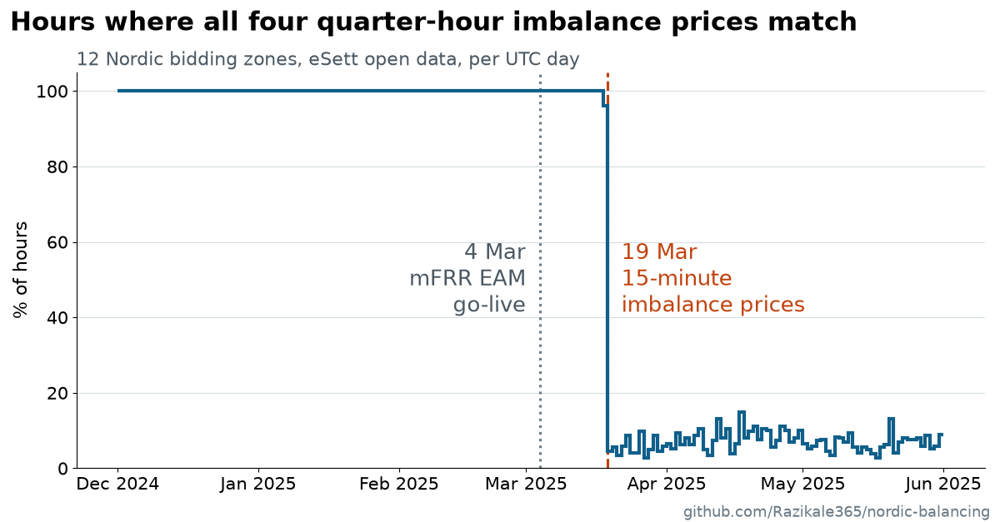

# When did Nordic imbalance prices become quarter-hourly?

I ran into this question while building nordic-balancing. The library puts every
series on 15-minute UTC intervals and keeps the resolution each source published at,
so it has to know when a series changed resolution. For Nordic imbalance prices, the
answer depends on whether you mean how often a price is published or how often it can
change.

eSett switched the Nordic imbalance settlement period to 15 minutes on 22 May 2023
([eSett, 23 May 2023](https://www.esett.com/news/the-nordic-electricity-market-has-switched-to-15-minute-imbalance-settlement-period/)).
Since then its open data has one imbalance price per quarter-hour for all 12 bidding
zones. The same announcement says the imbalance price "will be same for each
quarter-hour within an hour until 15 min prices are available and used." So when did
the four quarter prices of an hour start to differ?

**Answer: at 2025-03-19 00:00 CET (2025-03-18T23:00Z).** Before that hour, no zone ever
had differing quarter prices. From then on, they differ in most hours in every zone.

March 2025 had two separate 15-minute milestones, two weeks apart:

- **4 March:** the mFRR energy activation market (EAM) went live, "going from 60 minutes
  manual balancing to 15 minutes automated balancing"
  ([Statnett, on behalf of the four Nordic TSOs](https://statnett.no/en/for-stakeholders-in-the-power-industry/news-for-the-power-industry/confirmation-of-mfrr-eam-go-live-march-4th-2025)).
- **19 March:** from delivery day 19.03.2025, imbalance prices are calculated separately for
  each 15-minute imbalance settlement period
  ([eSett, 27 February 2025](https://www.esett.com/news/upcoming-changes-in-the-15-min-project/)).

The price data follows the second date.



The chart aggregates by UTC day. The switch came at 00:00 CET on 19 March, which is
23:00 UTC on 18 March. So the UTC day 18 March already contains one changed hour in 11
zones and shows 96 % instead of 100 %. That small step just before the dashed line is
the switch itself, not an earlier change.

Per zone, with the intra-hour price range (`analysis.py`):


## Evidence

Two scripts together cover every quarter-hour from the first 15-minute settlement period
to the end of May 2025, in all 12 zones:

| Period (UTC) | Script | Records | Zone-hours | Zone-hours with differing quarters |
|---|---|---:|---:|---:|
| 2023-05-21T22:00 to 2024-12-01 | `check_before_window.py` | 644,064 | 161,016 | 0 |
| 2024-12-01 to 2025-03-18T23:00 | `analysis.py` | 124,368 | 31,092 | 0 |
| 2025-03-18T23:00 to 2025-06-01 | `analysis.py` | 85,296 | 21,324 | 19,813 |

Every zone-hour in all three rows had four published, non-null prices. The first hour with
differing quarters is 2025-03-18T23:00Z in 11 zones. In NO3 that hour happened to have
four equal prices, as 11.8 % of NO3 hours still do after the switch; its first differing
hour is 2025-03-19T00:00Z.

After the switch, per zone (`analysis.py`, 2025-03-18T23:00Z to 2025-06-01):

| zone | hours with uniform quarters | mean intra-hour range, EUR/MWh |
|------|-----:|-------:|
| DK1  |  1.6 % | 164.16 |
| DK2  |  1.9 % | 203.77 |
| FI   |  0.6 % | 119.56 |
| NO1  | 11.8 % |  15.80 |
| NO2  |  9.1 % |  15.93 |
| NO3  | 11.8 % |  11.83 |
| NO4  | 16.8 % |  42.82 |
| NO5  | 19.0 % |  12.76 |
| SE1  |  2.3 % |  49.02 |
| SE2  |  2.0 % |  55.55 |
| SE3  |  3.4 % | 104.56 |
| SE4  |  4.7 % | 129.96 |

Before the switch, every zone had 100 % uniform hours and a range of 0. After it, quarter
prices within an hour often differ by tens to hundreds of EUR/MWh. The ranges are largest
in DK2, DK1, SE4, FI and SE3, and smallest in NO1, NO2, NO3 and NO5.

## Why it matters

Publication resolution and information content are different things. From May 2023 to
18 March 2025, eSett's series is published per quarter-hour but carries one price per
hour. A model trained across 19 March 2025, a backtest of quarter-hour flexibility, or a
measure of intra-hour spreads would otherwise treat repeated hourly prices as
quarter-hourly ones, and the earlier period would look flat by construction.

nordic-balancing keeps the publication resolution in `ImbalancePrice.resolution`, which
says 15 minutes for both periods. The change in information content is recorded
separately, as a dated market change: `nordic_balancing.changes_between()` returns it for
any window that spans 2025-03-18T23:00Z.

## Method

All three scripts use only the public `nordic_balancing` API and keyless eSett data
(`ESettClient`, `EXP14/Prices`).

- `analysis.py` fetches 2024-12-01 to 2025-06-01 UTC for all 12 zones (six requests of up
  to 31 days) and caches the result in `cache.json`. For each zone and hour it checks
  whether all four quarter prices are identical and computes the intra-hour range
  (max − min). It prints the table above, using the 2025-03-18T23:00Z switch as the
  before/after boundary, and plots `mfrr_transition.png` per UTC day.
- `summary_chart.py` reads `cache.json` and plots `summary.png`: the share of uniform hours
  across all zones, per UTC day, drawn as one step per day.
- `check_before_window.py` fetches 2023-05-21T22:00Z to 2024-12-01 live and counts the
  zone-hours whose quarter prices differ.

## Reproduce

```bash
uv run --with matplotlib python examples/mfrr_transition/analysis.py
uv run --with matplotlib python examples/mfrr_transition/summary_chart.py
uv run python examples/mfrr_transition/check_before_window.py
```

The first run of `analysis.py` fetches from eSett and writes `cache.json` (git-ignored).
Later runs, and `summary_chart.py`, reuse the cache; delete it to refetch.
`check_before_window.py` always fetches and takes about a minute. The numbers above are
from runs on 2026-10-09.

## Caveats

- Single source: eSett `EXP14/Prices`. The cross-check against the TSO feeds is a
  separate piece of work.
- The uniformity check covers May 2023 to May 2025. The after-switch statistics cover
  only 2025-03-19 to 2025-05-31, so they describe the first ten weeks, not a long-run
  average.
- The May 2023 switch was phased by country: eSett's announcement lists Denmark and
  Finland first, with Sweden and Norway to follow later. The checks here are about the
  published imbalance prices, which eSett's data contains per quarter-hour for all 12
  zones from 2023-05-21T22:00Z.
- `ImbalancePrice.resolution` records the publication cadence (15 minutes since
  2023-05-22), not the information content. Before the switch it says 15 minutes even
  though all four quarters carry the same value.
