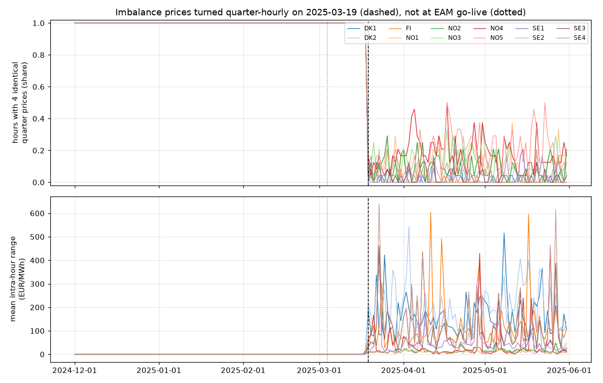

# When did Nordic imbalance prices become quarter-hourly?

Nordic imbalance settlement moved to 15-minute periods on 2023-05-22. A price
published per quarter-hour need not vary within the hour, though. So when did
the four quarter prices of an hour start to differ?

**Answer: 2025-03-19 00:00 CET (2025-03-18T23:00Z), in all 12 bidding zones.**
On that date mFRR energy pricing and imbalance pricing moved to 15 minutes,
together with 15-minute intraday cross-border trading
([Fingrid announcement](https://fingrid.fi/en/news/news/2025/go-live-of-15-min-intraday-cross-border-trading-in-the-nordics-on-1803-for-delivery-on-1903)).
The switch did **not** come at the mFRR energy activation market (EAM) go-live on
2025-03-04, which is the date often quoted. Every day from 1 to 17 March 2025 still had
identical quarter prices in 100 % of hours.



## Method

`analysis.py` uses only the public `nordic_balancing` API. It fetches eSett imbalance
prices (`ESettClient`, keyless, all 12 zones) for 2024-12-01 to 2025-06-01 UTC in six
chunked requests and caches them as `cache.json`. For each zone and hour it checks
whether all four quarter prices are identical, and computes the intra-hour range
(max − min). It then aggregates per UTC day and plots both against the EAM go-live
(dotted) and the 15-minute pricing switch (dashed).

## Results (run of 2026-10-09)

| zone | uniform quarters, before | after | mean intra-hour range before, EUR/MWh | after |
|------|-----:|-----:|-----:|-------:|
| DK1  | 100.0 % |  1.6 % | 0.00 | 164.16 |
| DK2  | 100.0 % |  1.9 % | 0.00 | 203.77 |
| FI   | 100.0 % |  0.6 % | 0.00 | 119.56 |
| NO1  | 100.0 % | 11.8 % | 0.00 |  15.80 |
| NO2  | 100.0 % |  9.1 % | 0.00 |  15.93 |
| NO3  | 100.0 % | 11.8 % | 0.00 |  11.83 |
| NO4  | 100.0 % | 16.8 % | 0.00 |  42.82 |
| NO5  | 100.0 % | 19.0 % | 0.00 |  12.76 |
| SE1  | 100.0 % |  2.3 % | 0.00 |  49.02 |
| SE2  | 100.0 % |  2.0 % | 0.00 |  55.55 |
| SE3  | 100.0 % |  3.4 % | 0.00 | 104.56 |
| SE4  | 100.0 % |  4.7 % | 0.00 | 129.96 |

The first non-uniform hour is 2025-03-18T23:00Z in 11 zones, and the next hour in NO3.
After the switch, quarter prices within an hour routinely differ by tens to hundreds of
EUR/MWh, most in DK and FI and least in the hydro-dominated NO zones.

Why it matters: data from before 2025-03-19 that is labelled "15-minute" holds only hourly
information. A model trained across that date, or a backtest of 15-minute flexibility, would
otherwise mistake repeated hourly prices for quarter-hourly ones.
`nordic_balancing.changes_between()` returns this switch as a dated market change.

## Reproduce

```
uv run --with matplotlib python examples/mfrr_transition/analysis.py
```

The first run fetches from eSett and writes `cache.json` (git-ignored). Later runs reuse
the cache. Delete it to refetch.

## Caveats

- Single source: eSett `EXP14/Prices`. The cross-provider check against the TSO feeds is a
  separate piece of work.
- A six-month window around the switch, not a long-run sample.
- `ImbalancePrice.resolution` records the publication cadence (15 min since 2023-05-22),
  not the information content. Pre-switch records say `15 min` even though all four
  quarters carry the same value. That is a known library limitation.
